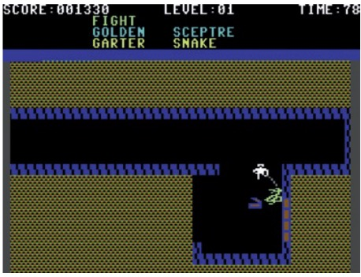

# 1.什么是老派角色扮演游戏（old-school RPG）

<iframe src="https://qiyukf.com/sdk/res/delegate.html?1629812084615" style="border: 0px; margin: 0px; padding: 0px; cursor: default !important; height: 0px; width: 0px;"></iframe>

by Jay Barnson

我在这里要做一个忏悔，这是一个老派风格游戏设计师的忏悔，也是一个经常吹嘘老派游戏很有趣的人的忏悔。

我不知道他妈的究竟什么是“老派”游戏！

是的，这些老的经典游戏在他们刚发行的时候我就在玩，到现在已经过去了这么多年我仍然在玩（嘿！我几个月之前又重新玩了一遍 *Ultima III*）。我记得很清楚，当*The Bard's Tale* 还很火爆的时候，我在书上和杂志上读了“幕后”的文章，那个时候的大玩家们似乎会分享各种RPG，但是现在这些早已经消失。我曾经在GDC（曾经叫做CGDC）上跟他们交谈过很长时间。但是这不意味着我知道我现在在讲述什么。

有的时候我有一些新点子，但是它明显的跟其他人的想法有冲突，我也不知道这是什么原因。这可能就是旁观者眼中的老派吧。

举个例子，就拿回合制游戏和实时动作的游戏来做比较。实时动作类的角色扮演类游戏已经有太多太多，同时也出现了很久。至今我还喜欢1983年发行的*Gateway to Apshai，*它是一个纯粹的动作街机游戏。这个游戏里包含RPG的元素，在用摇杆操作你的人物击杀像素敌人之后你可以拾取他们的掉落并且获得等级的提升。

我们也可以回到*Ultima III*和*Telengard*的世界。这两款游戏是我曾经玩过的经典角色扮演游戏。如果细分的话，这两款游戏都属于“实时回合制”的游戏。在每个回合的战斗中都有时间限制，你需要尽快决定自己的选择。更糟糕的是，游戏中唯一的“暂停”命令是进入一些输入循环，在这些循环中会对你下达的动作做更详细的确认。

说实在的，就我而言，尽管我喜欢把“回合制”游戏称为“老派”游戏，但事实是，自从有商业角色扮演游戏以来，回合制游戏和实时动作游戏就一直存在。

基于动作的游戏绝对没有什么新的、改进的或者更好的内核。也没有技术限制阻碍回合制和实时动作游戏的细分——因为但是市面上有很多动作角色扮演游戏。

动作游戏的品类太多了，就拿视角来举例，我们有自上而下的视角，第一人称视角，等距视角，侧面滚动视角，混合视角和疯狂变换的视角，甚至有些游戏会在战斗开始改变视角。

在复杂性上，游戏是当年最简单的标题，与“低俗”的现代产品相比，玩老派游戏就像是在驾驶航天飞机。

老派游戏中会有一些非常棒的战术内容，比如SSI的*Wizard‘s Crown*。也有具有大量动态生成的内容和无数分支的及其详尽的系统，比如*Daggerfall*。还有一些游戏是介于两者之间的。老派游戏会让你探索一个单一的，开放式的地牢，或者是一个开放式的世界，也可能是一层一层地引导你沿着一条非常狭窄的道路前进。

我们甚至不能确定那个时间范围内的游戏算是老派游戏。这可能是我的年龄的问题，但是我仍然很难将任何2000年之后发行的游戏视为老派游戏。

这就像开始玩游戏的历史，对于我来说，是1979年左右，与现在取一个中间的时间——大约是1996年，以此作为老派游戏的界限。

当然，这个界限不是那么固定的，但是我很难想象像*Oblivionas*这样的游戏是老派游戏。天哪。另外，在第一次玩老游戏的时候（像我，在前段时间通关了*Star Wars：KotOR II*)，我很难想象这些游戏竟然已经这么古老了。

当我谈论老派游戏的时候，我倾向于谈论我自己玩过的经典游戏，这里面会包含经典同时也会包含一些垃圾。在那个时候，我并不关心*AI-Qadim：The Genie's Curse*是否是真正的角色扮演游戏。因为几乎没有人关心这个，指导RPG的“热潮”在90年代初达到顶峰然后开始收缩。

当然，你可能会偶尔看到探讨角色扮演游戏和冒险游戏区别的文章。这在现在看起来是多么的古怪。确实，这两种类型都很好。我们是什么时候开始讨论游戏类型的问题的，这是怎么发生的？

或许我们可以对老派游戏下个定义了，老派游戏是指过去出售过，但是现在主流的发行商不再出版的具有令人惊叹的风格的游戏。

取而代之的是，发行商们将游戏的类型缩小到了一个很小的范围，这一部分类型是可以取悦大众的类型，发行商们也在尽力的完善它们。但是整个主流出版已经失去了相关性（至少是在PC游戏的开发上），我实在不明白它的重要性。

我仍然会将我所做的一些事情称为“老派”，但就像“独立”这个词一样，它实际上是潜在玩家重新设定期望的一种简单的缩写。但是旧的是新的新，或者是类似的东西。

讲到最后，我还是不知道我他妈到底在说什么。

*March 18, 2013*

------

自从*Pac-Man*和*Wizardry*流行以来，Jay Barnson就开始玩电子游戏，十多年来一直在开发独立游戏和顶级的“AAA”零售游戏。

------

*Gateway to Apshai：*1983年发行的动作游戏

*Ultima III：*你的每一个决定都有时间限制

有着顶级战术的：*Wizard's Crown*

*Al-Qadim: The Genie’s Curse：*有谁在乎他是不是RPG

