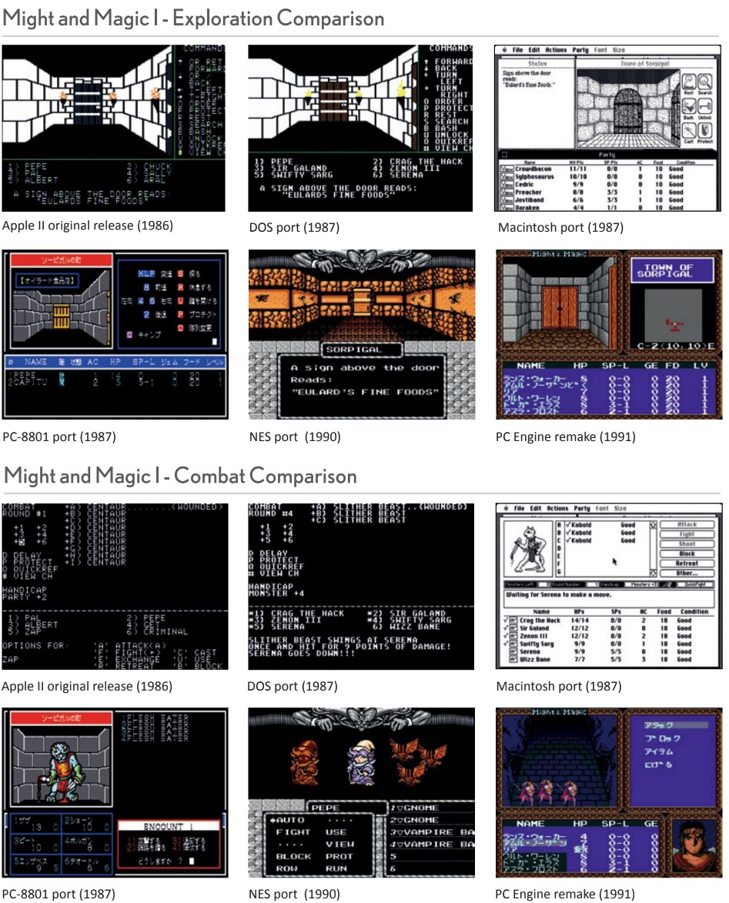

# 2.移植：远不止分辨率和帧率

By Felipe Pepe

现在，游戏在不同游戏平台上几乎没有什么差别，有的差别也就是轻微的视觉效果、轻微的帧数表现或者是有更高的分辨率，特别是在比较索尼和微软的游戏机的时候。PC端的一直可能会有更加细微的差别，比如4K分辨率、更多可以调节的视觉选项：如可视范围、支持mod。

当然，现在的情况跟上个世纪80年代差距太大了，当时市面上有非常多的平台，他们为了赢得消费者，通过使用不同的硬件设备来提高用户的体验。一些基础的组件比如色彩和声音都是可供选择的——1986年发布的Macintosh有声卡但是只能显示黑白两种颜色，然而当年发布的IBM PC能显示更多色彩但是声音只有从内部扬声器发出的哔哔声。

甚至色彩的显示在不同的机器上都不尽相同，比如蓝色，在Commodore64、Amstrad CPC和NES都完全不同，这也导致游戏的设计者们要针对不同的硬件设计不同的色彩。

还有更深层次的区别：一些计算机使用磁带，而另一些使用5¼英寸或3½ 英寸的软盘。一些机器支持鼠标输入，而另一些机器连硬盘都没有。因为这些差别，游戏在不同的机器上的速度和容量差别就会非常大。

还有一个因素是每个游戏移植的时间都不同。*Dungeon Master*于1987年发布在Atari ST平台，1988年发布在Amiga平台，最后在1992年移植到了MS-DOS上。有些公司也会随着时间流逝更新移植，1985年在Commodore 64平台上发布的*Phantasie*只有比较糟糕的画质和UI设计，然而到了1987年，其公司又发布了Amiga平台上的重置版，有了更好的色彩艺术还支持鼠标操作。

这种游戏移植的风格一直延续到2000年初期，因为游戏机的大规模普及、PC游戏开发商的经济困境、几家发行商巨头的市场主导地位以及XBox的到来等多种因素推动所有游戏走向多平台发布。

玩家们如果想知道老游戏的哪个版本是最好的，那么MS-DOS平台上的游戏是 最容易找到并且运行的——在GOG.com上能找到它们，并且有强大且易用的模拟器：DOSBox（DOSBox Daum有更多选项，DFend有易用的界面）。

对于在1985年到1990年发布的游戏，Commodore Amiga平台有着最好的画面表现，最好的声音表现，但是它的模拟器WinUAE运行起来非常麻烦。你也可以尝试Amiga Forever——它是付费的，但是有预设，易用性很强。

如果是1985年之前的游戏，Apple II的版本是最好的选择，AppleWin模拟器很易用，如果怕麻烦也可以尝试网页版的Virtual Apple II。

接下来的页面会展示不同平台上的游戏的效果，让你了解他们到底有多不同。

------

*Defender of the Crown* (1987)被用作展示Amiga的图象水平，虽然它的16-bit的竞争对手——Apple IIGS和Atari ST——可能会显示出非常相似的图像，但他们仍然失去了一些更精细的细节。这个比较展示了不同机器的特色，比如C64的深色。

------

甚至在同一平台上游戏都会有不同的体验。SSI的*Eye of the Beholder*（1991）发行与MS-DOS平台，使用了华丽的VGA接口，但同时支持老式的显示卡。现在在GOG重新发行的模拟器上运行它们默认都是以VGA进行显示，过去的玩家们如果机器比较老旧就只能使用EGA或者CGA模式进行游戏。

------

在Apple II平台上的发行的*The Bard‘s Tale*是最初的版本。它给人留下了印象深刻的视觉体验，因为在它之前，像*Wizardry*这样的地牢游戏都是基于线框画面的。然而，它的Amiga版本在一年后发行，就添加了鼠标的支持，画面也有了跨越式的进步，完全超越了原来的版本。然而这种16-bit的画面对硬件的要求非常高。以至于将它移植到相对便宜的机器上比如ZX Spectrum和Amstrad CPC难度很大，以至于几年之后才推出相应的版本。

------

并不是重新发行或者后来移植的版本会有提升。*Wizardry VII*在PlayStation平台上有3D版的移植，但是完全3D的画面不如原来的画面美观。更糟糕的是，在WIndows和MAC平台上重新发行的*Wizardry Gold*添加了许多bug、模糊的贴图、不一致的艺术风格并且只能运行在一个窗口里。在这种情况下，只需要坚持原来的版本就行。

------

*Might and Magic II*中的战斗在不同的版本中都差不多：使用键盘控制，一次只能出现一只怪物。而在Mac版本中，它完全由鼠标操作，并且通过Mac的GUI实现了同时显示多个窗口。虽然流畅，但玩家们发现使用键盘的热键操作队伍里的六个角色要简单的多。在日本的PC-9801的移植中也加入了鼠标的支持，但是不同于多窗口，这次它拥有了与之前完全不同的战斗界面，可以同时显示所有玩家和敌人。

------

*Might and Magic I*在Apple II平台上首发。它的DOS版本的移植在随后发行，并且跟Apple II的版本几乎一致——仅仅是改变了字体和颜色。在MAC上的移植添加了鼠标的支持、高分辨率的图象、引入了一个非常漂亮的界面。在日本的机器中对图象进行了大幅度的调整，也成为了最好的发行版本。

NES中的移植发生了非常大的变化——界面成了基于菜单式的、添加了一个小地图、图象更好了，成为了最好的支持英语的版本。最后，PC Engine上的是完全的重置版——它添加了日文的翻译，它有六个固定的英雄，一个有趣的介绍序列，还在页面上添加了一个小地图，并且支持全语音。可惜的是只有日文版本。
