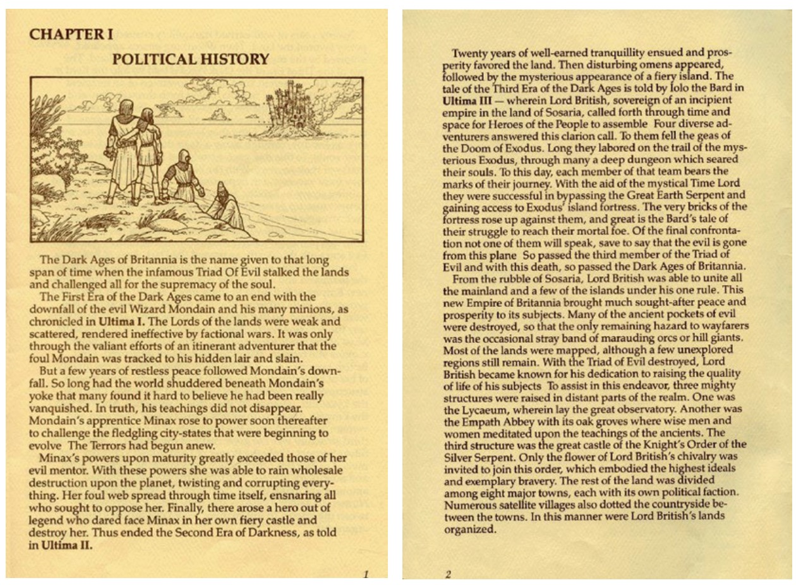

# 3.玩不了

在我教师生涯中最让我满意的事情是在两年之前：15名学生克服了抗拒和迷惑，最终喜欢上了最初的*Fallout*。我写下了这段经历，并且从那时起，我开始继续让我的学生们尝试他们舒适圈外的游戏：经典街机游戏（比如*Defender*）；交互式小说（比如 *Planetfall*）；还有早期的地牢游戏（比如 *Rogue*）。

但我注意到，在过去的六年左右的时间里，出现了一个普遍下降的趋势。渐渐地，我的学生在处理*Ultima IV*中特殊任务的能力上越来越弱。

可以肯定的是，他们在玩像*Planetfall*的游戏的时候遇到了困难，但是当他们最终学习到了游戏的语法时（并且听从我的建议，绘制他们的进度图）。这主要是一个解决难题的问题。*Defender*在一开始让他们备受打击，但是他们很快采用了在玩现代游戏时锻炼出来的快速反应能力克服这些困难，他们非常棒！

*Ultima IV*是另一个故事，以下是我为促进课外游戏讨论而设立的论坛里的贴子样本：

> “我对整个游戏体验十分困惑。老实说，我已经坐在这里好几个小时了，我想知道该做些什么，但是现在这对我来说没有任何意义。 ”

> “当我玩游戏的时候，我喜欢自己玩，不借助任何外力，但是在*Ultima IV*的世界中这是不可能的。我已经向我的朋友们寻求了帮助，看了FAQ和使用指南，甚至在YouTube上搜索了怎么玩*Ultima 4*然而我还是不确定如何在游戏里再走下一步。”
>

> “是的，我仍然不知道游戏的主要目标是什么。我假设目标是找出Ankh的意图是什么。但是我不知道该怎么进行下一步。”

> “我尝试了一段时间不看任何指南以获得一个完整的游戏体验，然而几个小时后我放弃了，因为游戏糟糕的操作，和对于我来说难以理解的剧情。这让我想起了糟糕的*RuneScape*。”

> “我不太理解这个游戏的概念。我认为最大的困惑是游戏的操作以及你做了什么和怎么移动的显示方式。我不经常玩RPG，也不太喜欢这个类型。我希望找到前进的方向，但我不是很幸运。”

> “我死了之后该他妈怎么出去！”

他们有5天的时间体验*Ultima IV*并且我提醒他们在玩的时候做好规划。当我们在课堂上汇报的时候，一些学生介绍了他们在游戏中如何克服游戏中遇到的困难，但是绝大部分学生对这个游戏感到十分困惑。正如他们中的一位学生所说：“我想说：对于我们这代玩家来说，想*Ultima IV*这样的RPG很无聊并且几乎没法玩。”我取下胸前的箭头后，请他们解释原因。

问题集中在用户界面、导航指示、战斗，以及要在游戏里做什么和怎么做不是很清楚。我给他们提供了两本书：《Book of Mystic Wisdom》和《History of Britannia》，两者都是PDF版本，但是没有一个学生费心读它们。“我认为它们应该集成在游戏里面”，一名学生说。

|  |
| :----------------------------------------------------------: |
| *Ultima IV*的《History of Britannia》小册子中的两页，每一本游戏都有。 |

