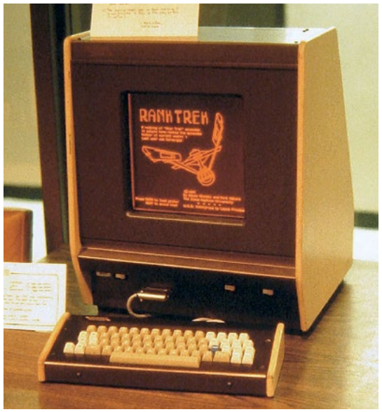

# 5.The PLATO RPG

> by Felipe Pape

随着家用电脑在我们的日常生活中无处不在，我们也很难意识到它们是一项多么新的技术。在上个世纪70年代中期，家用电脑开始出现之前，那时的电脑都是十分巨大的机器，各个都重达几吨并且占据了整个楼层。

然而，有一些计算机远远领先于它们的时代。Douglas Engelbart在1968年制了的传奇“Mother of All Demos”演示文稿。展示了他使用鼠标和基于窗口的GUI通过点击超链接并且通过视频会议与同事聊天，并共同编辑在线文本。

PLATO （自动教学操作的编程逻辑Programmed Logic for Automatic Teaching Operations）是一类前卫的计算机系统，于上个世纪60年代发明，是一个有着良好用户界面设计的终端系统，能通过虚拟课程给大学生上课。

发布于1972年的PLATO IV系统甚至提供了基于向量的图像，触摸屏的界面和一个类似因特网的网络——连接了全球数以千计的其他终端系统。

学生们马上发现这个系统也可以用来制作游戏，于是叫做*Empire*(1973)和*Spasim*(1974)的两款游戏开始出现。*Empire*尤其令人印象深刻：这是一款支持最多30名玩家在自上而下的太空竞技场中战斗的游戏，玩家们互相设计对方的船只并以控制银河系为战——这都发生在1973年！

当*Dungeons & Dragons*于1974年问世时，它掀起了一场完美风暴：强大的计算机、无聊的编程学生和一个乞求自动化的统计驱动游戏。 结果是角色扮演游戏的诞生。

可悲的是，并不是所有的游戏都活了下来。PLATO系统仍然是一个教学系统，所以他的管理员可以删除未授权的游戏。因此，我们丢失了创作于1974年的有史以来的第一款CRPG：*m119h*。但是它的继任者却保留了下来——它们隐藏于像*pedit5*这样不起眼的名字下或者被学生保存了下来。后来有成千上万的玩家玩过它们，它们也影了后来的很多游戏。

感谢[Cyber1](https://www.cyber1.org/index.asp)的努力，它是一个致力于保存PLATO遗产的社区，这些早期的CRPG仍然可以免费游玩。但是，请记住有一些游戏在70年代以来一直在更新——*Oubliette*的标题屏幕甚至有它在iPhone上重置的广告——尽管它们不是人们当时玩的过的版本，但是它们仍然给了我们一个很好的想法。

如果你还想更深得了解PLATO，我非常诚恳的推荐由Brian Dear著作的[友好的橙色光芒：PLATO系统不为人知的故事和网络文化的黎明](http://friendlyorangeglow.com/)(2017)。虽然这本书只提到了一点游戏方面的东西，但是它是了解PLATO和其影响的最佳资源。

|  |
| :----------------------------------------------------------: |
| 一个PLATO终端，带有一个独特的橙色等离子显示屏。到1976年，全球共有950个这样的终端。 |

