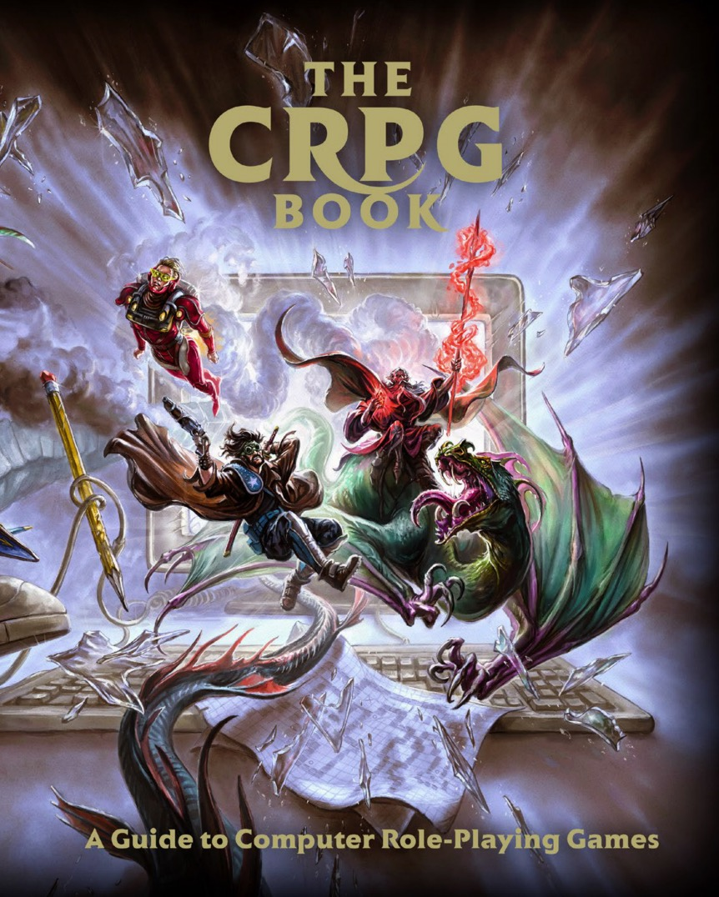

# CRPG-BOOK
这是一个兴趣使然的工作，我是一名计算机专业的研究生，游戏是我的爱好，我的目标是成为一名游戏设计师（俗称游戏策划，game designer），设计一些给人们带来快乐的游戏，成为小岛秀夫那样优秀的游戏制作人是我的梦想。因为会一点英语，也想了解一些游戏的历史，所以想翻译一下《CRPG BOOK》这本书，这本书在圈子里还挺火，看到网上有好几波人都在翻译他但是都没有翻译完。

我呢，全凭兴趣，现在准备每天翻译一篇文章，看看我能坚持多久。希望大家都过来star我的项目，有翻译不准确的地方也希望大家给我指出来（毕竟不是专业的翻译，达不到信达雅的标准\哈哈)

原书链接：https://crpgbook.wordpress.com

pdf下载链接：https://crpgbook.files.wordpress.com/2019/04/crpg_book_2.0-1.pdf

